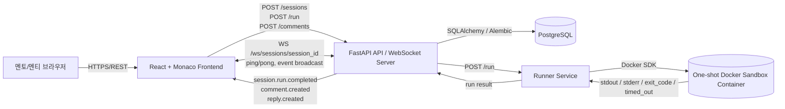

# 최종 보고서

## A. 프로젝트 명

**CodeSession**

부제: **Docker 샌드박스 기반 실시간 알고리즘 코드 멘토링 플랫폼**

이 프로젝트는 멘토와 멘티가 같은 세션 안에서 코드를 실행하고, 실행 결과와 오류 메시지를 공유하며, 특정 코드 라인에 대해 질문과 답변을 주고받을 수 있는 웹 기반 멘토링 서비스이다.

## B. 프로젝트 멤버 이름 및 멤버 별 담당한 파트 소개

- **Amartuvshin (Frontend 담당)**: React + Monaco Editor 기반 UI, 실행 결과 패널, 라인별 질문/답변 화면, WebSocket 알림 표시
- **황수환 (Backend 담당)**: FastAPI API, 세션/실행/댓글/답글 처리, WebSocket room 관리, PostgreSQL 연동
- **박찬오 (Cloud/Infra 담당)**: Docker Compose, Azure VM backend stack 배포 검증, Docker 샌드박스 제한, 환경변수 관리, 운영 문서 정리

## C. 프로젝트 소개

CodeSession은 알고리즘 학습과 코드 멘토링에 특화된 실시간 웹 플랫폼이다. 사용자는 세션 링크로 같은 공간에 들어와 Python 코드를 작성하고 실행할 수 있으며, 실행 결과와 오류 메시지를 바로 확인할 수 있다. 또한 코드의 특정 라인에 질문을 남기면 멘토가 답변을 달고, 이 변경 사항은 WebSocket을 통해 같은 세션 참여자에게 즉시 알려진다.

핵심 구조는 다음과 같다.

- **Frontend**: React, Monaco Editor 기반 코드 편집 화면, 결과 UI, REST/WebSocket 연동
- **Backend**: FastAPI 기반 REST/WebSocket 서버
- **Runner**: 사용자 코드를 요청마다 일회용 Docker 컨테이너에서 실행하는 내부 서비스
- **DB**: PostgreSQL에 세션, 실행 로그, 댓글, 답글 저장
- **Deploy**: 프론트엔드는 정적 빌드 산출물로 제공하고, 백엔드/러너/DB는 Azure VM 내부 Docker Compose 구성을 기준으로 배포

이 프로젝트는 단순한 온라인 저지보다 멘토링 상황에 더 가깝게 설계되었다. 정답 판정 자체보다, 실행 결과를 함께 보면서 코드의 특정 줄을 설명하고 토론하는 흐름을 지원하는 것이 목적이다.

## D. 프로젝트 필요성 소개

알고리즘 멘토링에서는 참여자마다 개발 환경이 다르기 때문에, 같은 코드도 다른 결과를 낼 수 있다. 특히 멘티가 작성한 코드는 무한 루프, 과도한 메모리 사용, 비정상 종료, 파일 시스템 접근 같은 위험을 가질 수 있어, 서버 안정성을 지키면서 실행하는 구조가 필요하다.

CodeSession은 이 문제를 해결하기 위해 사용자 코드를 서버 프로세스에서 직접 실행하지 않고, Runner가 요청마다 일회용 Docker 샌드박스 컨테이너를 생성하여 격리 실행하도록 설계했다. 실행이 끝나면 stdout, stderr, 종료 코드, timeout 여부만 수집하고 컨테이너는 삭제된다.

해당 프로젝트의 필요성은 크게 세 가지로 요약할 수 있다.

- **안전성**: 신뢰할 수 없는 코드를 서버와 분리된 컨테이너에서 실행
- **재현성**: 동일한 실행 환경과 제한 조건을 통해 결과를 일관되게 확인
- **협업성**: 질문/답변과 실행 결과를 한 세션에 묶어 실시간 멘토링 가능

## E. 관련 기술/논문/특허 조사 내용 소개

직접적인 논문/특허 조사보다는, 유사한 기능을 제공하는 제품과 기술을 중심으로 선행 사례를 조사했다.

### 관련 제품 및 기술

- **Replit / CodeSandbox**
  - 브라우저 기반 개발 환경과 협업 기능을 제공한다.
  - 다만 프로젝트 단위 기능이 많아, 단일 알고리즘 파일을 빠르게 실행하고 라인별 멘토링을 하는 흐름에는 상대적으로 무겁다.
  - 출처: https://replit.com, https://codesandbox.io

- **VS Code Live Share / JetBrains Code With Me**
  - 로컬 IDE 화면을 공유하며 협업할 수 있는 강력한 도구다.
  - 하지만 참여자가 특정 IDE와 계정을 준비해야 하며, 웹 브라우저만으로 접속해 실행 결과와 질의응답을 관리하는 구조와는 목적이 다르다.
  - 출처: https://visualstudio.microsoft.com/services/live-share/, https://www.jetbrains.com/code-with-me/

- **온라인 저지 및 자동 채점 서비스**
  - 프로그래머스 같은 서비스는 제출 코드 실행과 채점에 특화되어 있다.
  - CodeSession은 정답 판정보다 멘토링 세션 안에서 코드 실행 결과를 공유하고 설명하는 과정에 초점을 둔다.
  - 출처: https://programmers.co.kr

- **GitHub Pull Request Review**
  - 코드 라인 단위 코멘트 기능은 유사하지만, 비동기 PR 리뷰 도구이다.
  - CodeSession은 PR 없이 하나의 세션 안에서 실행 결과, 질문, 답변, 실행 로그를 관리한다.
  - 출처: https://github.com/features/code-review

## F. 프로젝트 개발 결과물 소개 (+ 다이어그램)

현재 저장소 기준 개발 결과물은 다음과 같다.

- **frontend/**: Vite React TypeScript 기반 프론트엔드, Monaco Editor, REST API/WebSocket 클라이언트
- **backend/**: FastAPI REST/WebSocket 서버
- **runner/**: Docker 샌드박스 실행 Runner
- **docker-compose.yml**: backend, runner, postgres 통합
- **infra/**: Azure VM backend stack 배포/검증 문서
- **docs/api-contract.md**: 프론트와 백엔드가 공유하는 API 계약

### 구현된 기능

- 세션 생성 및 조회
- 코드 실행 요청 및 결과 저장
- 실행 이력 조회 및 실행 당시 코드 스냅샷 복원
- 라인별 질문 작성 및 답글 작성
- 세션 단위 WebSocket 알림
- PostgreSQL 저장
- Runner를 통한 격리 실행
- Docker Compose 기반 로컬/VM 통합 실행
- Azure VM 기반 backend/runner/postgres stack 배포 검증

### 시스템 구성도



### 동작 흐름

1. 사용자가 프론트엔드에서 세션에 입장한다.
2. 프론트엔드는 백엔드 REST API로 세션, 코드 실행, 댓글/답글을 요청한다.
3. 백엔드는 PostgreSQL에 데이터를 저장한다.
4. 코드 실행 요청이 들어오면 백엔드는 Runner에 내부 API로 전달한다.
5. Runner는 Docker 샌드박스 컨테이너를 새로 만들고 Python 코드를 격리 실행한다.
6. 실행 결과는 백엔드로 돌아오고, 백엔드는 결과를 저장한 뒤 WebSocket으로 세션 참여자에게 알린다.

### 현재 구현 상태

실제 구현은 제안서의 전체 방향을 기반으로 진행되었고, 현재 저장소에서는 아래 범위가 확인된다.

- 백엔드: `GET /health`, `POST /sessions`, `GET /sessions/{session_id}`, `POST /sessions/{session_id}/run`, 댓글/답글 API, WebSocket heartbeat
- 러너: Python 코드 샌드박스 실행, timeout, 이미지 pull fallback, 컨테이너 삭제
- 프론트엔드: Monaco Editor 기반 코드 편집 화면, 실행 결과 패널, 실행 이력/코드 스냅샷 복원 UI, 질문/답글 UI, REST API/WebSocket 연동, WebSocket 이벤트 로그
- 인프라: Docker Compose, Azure VM backend stack 배포 검증, 외부 health check, 포트 정책, 운영 문서

또한 현재 백엔드는 모든 세션 관련 API와 WebSocket 연결에서 `session_id`의 존재 여부를 확인하고, 잘못된 세션 접근은 즉시 거절한다. 외부 사용자는 backend만 호출하고 runner와 PostgreSQL은 Docker Compose 내부 네트워크에서만 접근 가능하게 구성되어 있다. 로컬 통합 검증에서는 세션 생성, 코드 실행, 실행 이력 조회, 코드 스냅샷 복원, 라인별 질문, 답글 작성, WebSocket 알림, 새로고침 후 실행 이력과 질문/답글 유지까지 확인했다.

## G. 개발 결과물을 사용하는 방법 소개 (설치 방법, 동작 방법 등)

### 로컬 서버 실행

로컬에서는 백엔드, Runner, PostgreSQL은 Docker Compose로 실행하고, 프론트엔드는 `frontend` 폴더에서 별도로 실행한다. 먼저 환경변수 파일을 준비한 뒤 backend stack을 올린다.

```powershell
Copy-Item .env.example .env
docker compose up --build -d
```

이 명령으로 아래 서비스가 실행된다.

- Backend API: `http://localhost:8000`
- Runner internal API: `http://runner:8001`
- PostgreSQL: `localhost:5432`

제출 기준 데이터베이스는 빈 PostgreSQL에서 시작하는 구성을 기준으로 한다. PostgreSQL 데이터 자체나 Docker volume은 제출물이 아니며, backend 컨테이너가 시작될 때 Alembic migration을 실행해 필요한 테이블을 생성한다. 이미 예전 버전으로 실행한 로컬 `postgres-data` volume이 남아 있으면 현재 스키마와 충돌할 수 있으므로, 기존 데이터를 보존할 필요가 없는 로컬 환경에서만 volume을 초기화한 뒤 다시 실행한다.

프론트엔드는 별도 터미널에서 실행한다.

```bash
cd frontend
npm install
npm run dev
```

기본 접속 주소는 `http://localhost:5173/` 이다.

실행 후에는 브라우저에서 프론트엔드 접속 주소를 열고 세션 생성, 코드 실행, 질문/답변 흐름을 확인한다. 전체 연동 상태를 점검하고 싶으면 아래 스모크 테스트를 실행한다.

```bash
python scripts/compose-smoke-test.py
```

이 스모크 테스트는 세션 생성, 코드 실행, 실행 이력 조회, 댓글/답글, 기본 연동 흐름을 확인하는 용도다.

## H. 개발 결과물의 활용방안 소개

CodeSession은 다음과 같은 환경에서 활용할 수 있다.

- 알고리즘 스터디에서 멘토와 멘티가 같은 세션을 보며 코드 리뷰
- 코딩 테스트를 준비할 때 코드 실행 결과와 오류를 빠르게 공유
- 대학 프로그래밍 수업에서 실습 보조 도구로 사용
- 원격 멘토링에서 라인별 질문과 답변 기록을 남기는 학습 도구로 사용

이 프로젝트의 핵심 가치는 “코드 실행” 자체보다, 실행 결과를 중심으로 한 학습과 피드백의 흐름을 안전하게 만드는 데 있다.

## I. AI 활용 (어떤 AI를 사용하여 개발했으며, 전체 코드의 몇 %가 AI로 개발되었는지를 설명)

본 프로젝트에서는 ChatGPT 계열 AI 보조 도구(Codex 포함)를 문서 정리, 코드 구조 초안 생성, 반복적인 보일러플레이트 작성, 테스트 초안 작성, 보고서 문장 정리에 활용했다.

AI 활용 범위는 주로 다음과 같다.

- README 및 보고서 구조 정리
- API 계약 문서 초안 정리
- FastAPI / React / Docker 관련 반복 코드 초안
- 테스트 코드와 설명 문구 정리

핵심 설계, 프로젝트 방향 설정, API 흐름 결정, 샌드박스 제한 조건, 배포 구조, 실제 통합 판단은 사람이 직접 수행했다.

전체 코드 기준으로 보면 AI가 직접 작성했거나 직접 작성에 준하는 수준으로 큰 도움을 준 비율은 약 30~40% 정도로 예상된다. 특히 반복적인 보일러플레이트, 초기 컴포넌트 초안, 테스트 코드 초안, 문서 정리는 AI의 보조 비중이 높았고, 핵심 아키텍처와 보안 정책, API 계약, 배포 방식은 사람이 주도했다.
